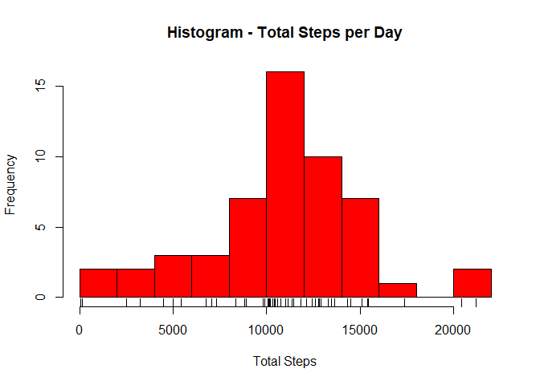
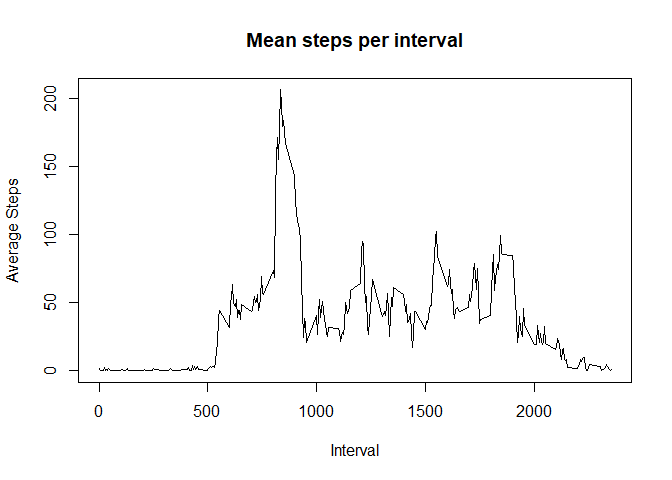
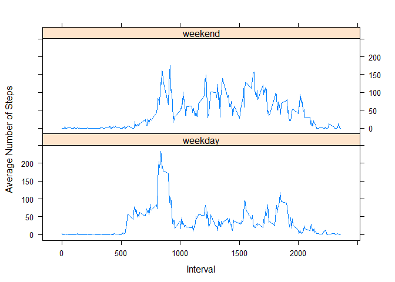

## Loading and preprocessing the data

Unzip and load the file.


```r
zipFile <- 'activity.zip'
unzip(zipfile = zipFile, 'activity.csv')
data <- read.csv(file = 'activity.csv', stringsAsFactors = FALSE)

## Convert the date column to Date
data$date <- as.Date(data$date, format="%Y-%m-%d")

## Top 5 rows
head(data, n=5)
```

```
##   steps       date interval
## 1    NA 2012-10-01        0
## 2    NA 2012-10-01        5
## 3    NA 2012-10-01       10
## 4    NA 2012-10-01       15
## 5    NA 2012-10-01       20
```

```r
str(data)
```

```
## 'data.frame':	17568 obs. of  3 variables:
##  $ steps   : int  NA NA NA NA NA NA NA NA NA NA ...
##  $ date    : Date, format: "2012-10-01" "2012-10-01" ...
##  $ interval: int  0 5 10 15 20 25 30 35 40 45 ...
```

## What is mean total number of steps taken per day?

1. Calculate the total number of steps taken per day


```r
library(dplyr)
```


```r
total_steps_per_day <- 
        as.data.frame(data %>% 
                              group_by(date) %>% 
                              summarise(totalSteps = sum(steps))
        )

## Top 5 rows
head(total_steps_per_day, n=5)
```

```
##         date totalSteps
## 1 2012-10-01         NA
## 2 2012-10-02        126
## 3 2012-10-03      11352
## 4 2012-10-04      12116
## 5 2012-10-05      13294
```

2. If you do not understand the difference between a histogram and a barplot, research the difference between them. Make a histogram of the total number of steps taken each day


```r
hist(total_steps_per_day$totalSteps, 
     breaks = 10,
     col="red", 
     main = "Histogram - Total Steps per Day",
     xlab = "Total Steps")
rug(total_steps_per_day$totalSteps)
```

<!-- -->

3. Calculate and report the mean and median of the total number of steps taken per day


```r
summary(total_steps_per_day$totalSteps)
```

```
##    Min. 1st Qu.  Median    Mean 3rd Qu.    Max.    NA's 
##      41    8841   10765   10766   13294   21194       8
```

## What is the average daily activity pattern?

1. Make a time series plot (i.e. type = "l") of the 5-minute interval (x-axis) and the average number of steps taken, averaged across all days (y-axis)

First, group the data by interval and calulate the mean steps.


```r
time_series_data <- 
        as.data.frame(
                data%>%
                        group_by(interval) %>%
                        summarise(meanSteps = mean(steps, na.rm = TRUE))
        )

head(time_series_data, n=5)
```

```
##   interval meanSteps
## 1        0 1.7169811
## 2        5 0.3396226
## 3       10 0.1320755
## 4       15 0.1509434
## 5       20 0.0754717
```

Time Series plot -


```r
plot(time_series_data$interval, time_series_data$meanSteps, 
     type = "l",
     main = "Mean steps per interval",
     xlab = "Interval",
     ylab = "Average Steps",
     )
```

<!-- -->


2. Which 5-minute interval, on average across all the days in the dataset, contains the maximum number of steps?


```r
head(time_series_data[order(time_series_data$meanSteps, decreasing=TRUE), ], n=5)
```

```
##     interval meanSteps
## 104      835  206.1698
## 105      840  195.9245
## 107      850  183.3962
## 106      845  179.5660
## 103      830  177.3019
```

The interval '835' has the maximum number of steps.

## Imputing missing values

1. Calculate and report the total number of missing values in the dataset (i.e. the total number of rows with NAs)

Total NAs: 

```r
sum(is.na(data))
```

```
## [1] 2304
```

Percentage NAs:


```r
mean(is.na(data))
```

```
## [1] 0.04371585
```

2. Devise a strategy for filling in all of the missing values in the dataset. The strategy does not need to be sophisticated. For example, you could use the mean/median for that day, or the mean for that 5-minute interval, etc.

Strategy - Using mean of the interval to substitute the NAs 
(the time_series_data dataframe created above will be used to get the means)

The below function populates the NAs in the dataset with the above strategy.


```r
populateNAWithMean <- function(x) {
        i<-0
        for(i in 1:nrow(x)) {
                if(is.na(x[i, ]$steps)) {
                        x[i, ]$steps <- 
                                time_series_data[
                                        time_series_data$interval ==x[i, ]$interval, ]$meanSteps
                }
        }
        x
}
```


3. Create a new dataset that is equal to the original dataset but with the missing data filled in.


```r
data_with_nas_fixed <- populateNAWithMean(data)
```

Checking the NA count for verification:

```r
sum(is.na(data_with_nas_fixed))
```

```
## [1] 0
```

4. Make a histogram of the total number of steps taken each day and Calculate and report the mean and median total number of steps taken per day. Do these values differ from the estimates from the first part of the assignment? What is the impact of imputing missing data on the estimates of the total daily number of steps?


```r
total_steps_per_day <- 
        as.data.frame(data_with_nas_fixed %>% 
                              group_by(date) %>% 
                              summarise(totalSteps = sum(steps))
        )
```


```r
hist(total_steps_per_day$totalSteps, 
     breaks = 10,
     col="red", 
     main = "Histogram - Total Steps per Day (No NAs)",
     xlab = "Total Steps")
rug(total_steps_per_day$totalSteps)
```

-1.png)<!-- -->

Mean and Median of total steps


```r
summary(total_steps_per_day$totalSteps)
```

```
##    Min. 1st Qu.  Median    Mean 3rd Qu.    Max. 
##      41    9819   10766   10766   12811   21194
```

There doesn't seem to be a big impact with missing data. It was only 4% of the original dataset.  
The Means and Medians dont seem to differ a lot.

## Are there differences in activity patterns between weekdays and weekends?

1. Create a new factor variable in the dataset with two levels -- "weekday" and "weekend" indicating whether a given date is a weekday or weekend day.  

New variable *dayType*

```r
data$dayType <- ifelse(weekdays(data$date) %in% c("Saturday", "Sunday"), "weekend", "weekday" )
data$dayType <- as.factor(data$dayType)
```

2. Make a panel plot containing a time series plot (i.e. type = "l") of the 5-minute interval (x-axis) and the average number of steps taken, averaged across all weekday days or weekend days (y-axis).  


```r
library(lattice)
```


```r
timeseries_data_by_dayType <- 
        as.data.frame(
                data%>%
                        group_by(interval, dayType) %>%
                        summarise(meanSteps = mean(steps, na.rm = TRUE))
        )

with(timeseries_data_by_dayType, {
        xyplot(meanSteps~interval|dayType,
               type="l",
               xlab = "Interval",
               ylab = "Average Number of Steps",
               layout=(c(1,2)) )
        
}) 
```

<!-- -->
